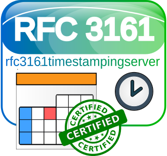

# rfc3161timestampingserver

<!---
[](http://www.ted.com/talks/simon_sinek_how_great_leaders_inspire_action)
--->
[](https://GitHub.com/elbosso/rfc3161timestampingserver/releases/)
[](https://GitHub.com/elbosso/rfc3161timestampingserver/tags/)
[](https://www.java.com)
[](https://github.com/elbosso/rfc3161timestampingserver/blob/master/LICENSE)
[](https://GitHub.com/elbosso/rfc3161timestampingserver/issues/)
[](https://GitHub.com/elbosso/rfc3161timestampingserver/issues?q=is%3Aissue+is%3Aclosed)
[](https://github.com/elbosso/rfc3161timestampingserver/issues)
[](https://GitHub.com/elbosso/rfc3161timestampingserver/graphs/contributors/)
[](https://github.com/elbosso/rfc3161timestampingserver)
[](https://elbosso.github.io/)



## Overview

This project offers a [RFC 3161](https://tools.ietf.org/html/rfc3161) compliant timestamping authority/server - you can build it by issuing

```
mvn compile package
```

and then starting the resulting monolithic jar file by issuing

```
$JAVA_HOME/bin/java -jar target/rfc3161timestampingserver-<version>-jar-with-dependencies.jar
```
*Note, however, that to be fully functional, the server needs cryptographic
material, namely*
 * *a certificate named _tsa.crt_*
 * *a private key matching the certificate named _tsa.key_*
 * *and the certificate chain for the certificate named _chain.pem_*
 
*all inside the directory _src/main/resources/rfc3161timestampingserver/priv_.*

The easiest way to get these files is to use a Certificate Authority
managed by project [expect-dialog-ca](https://github.com/elbosso/expect-dialog-ca).
Another advantage of using this project is that you get a configuration file
_tsa.conf_ for working with timestamps using 
[OpenSSL](https://www.openssl.org/) for free (see below).

Alternatively one could just start the server using maven by  issuing

```
mvn compile exec:java
```

In both cases, the server starts on port 7000 - at the moment
only POST  and GET requests are supported. POSTs accept either a body of mimetype
`application/timestamp-query` consisting as the name hints an timestamping request
or if the mimetype is `multipart/form-data`, the form must contain a file
named _tsq_ again being a timestamp request. In case the request brings with it
a valid timestamp request - it is then answered with a matching timestamp reply.
GET is available to search for timestamp replies for checking the integrity.

At the moment, this is a prototype. It still lacks support for TLS.
Serial numbers are stored in a relational database.

The recommended mode of using this is to use the provided Dockerfile 
and docker-compose.yml file. It already brings a correctly configured postgres
instance with it. It is probably better 
to actually use a proxy solution like traefik (the docker-compose is 
already prepared for this) or similar
solutions so the services are actually accessible with a sound hostname and 
some default port.

## Working with it

The project offers some resources to make it easier working with timestamps:
One of them is available under `http://<host>:<port>/tsa.conf`.
It is a configuration that can be used with 
[OpenSSL](https://www.openssl.org/) to create a certificate
request like so:
```shell script
openssl ts -query -config tsa.conf -cert -sha512 -data <path>/<some_file> -no_nonce -out <request_path>/<request>.tsq
```
This request can be sent using a HTTP POST request as multipart form data
(for example from a file upload form inside a web page):
```shell script
curl -F "tsq=@<request>.tsq" http://<host>:<port>/ ><reply>.tsr
``` 
The file _reply.tsr_ contains the timestamp. Alternatively,
this also works with a POST request containing the timestamp query in 
the body of said request having the correct mime-type:
```shell script
curl -H "Content-Type: application/timestamp-query" --data-binary '@<request>.tsq' http://<host>:<port>/ ><reply>.tsr
```
The content of the timestamp (useful for ascertaining the time and date
for example) can be displayed for example with the help of 
OpenSSL command line tools like so:
```shell script
openssl ts -config tsa.conf -reply -in <reply>.tsr -text
```
To verify the timestamp, OpenSSL can help too:
```shell script
openssl ts -verify -config tsa.conf -queryfile <request>.tsq -in <reply>.tsr -CAfile chain.pem
```

The server offers the possibility to search for a message digest - either
with 

```shell script
curl -F "algoid=x.y.z" -F "msgDigestBase64=<base64encodedDigest>" http://<host>:<port>/query --output <queried>.tsr
```

or without specifying the message digest algorithm for computing it:

```shell script
curl -F "msgDigestBase64=<base64encodedDigest>" http://<host>:<port>/query --output <queried>.tsr
```

Alternatively it is possible to search for a message digest formatted as hexdump
without colons as for example sha512 generates:

```shell script
sha512sum <path>/<some_file>
```

```shell script
curl -F "msgDigestHex=<msgDigestAsHexdump>" http://<host>:<port>/query --output <queried>.tsr
```

This project offers a server that adheres to standards - this way, it
can be used as standin for any solution that needs access to a timestamping
server. One example for that is the Java build tool [Ant](https://ant.apache.org/): 
it has a `signjar`
task that takes an attribute named `tsaurl`. If one sets this parameter to
`http://<host>:<port>/`, the jar file is not only signed but also timestamped.

This can get important when the application the jar belongs to is started after
the signing certificate is expired: Ordinarily, the app would not start anymore
but the timestamp guarantees that the certificate was valid at the time 
the timestamp was created and so the application can be used after expiration of the signing
certificate up to the expiration of the timestamping certificate.
